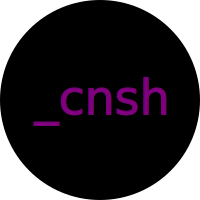

# cnsh
            


`cnsh` is a lightweight package manager that provides a minimal alternative to Yarn. It fetches packages from the npm registry and installs them in a simplified directory structure.

## Features

- **Add Packages**: Install packages from the npm registry.
- **Remove Packages**: Uninstall packages from your project.
- **Install Dependencies**: Install all dependencies listed in `package.json`.
- **Global and Local Installation**: Supports both global and local package management.
- **Simple and Efficient**: Focuses on essential features for ease of use.

## Installation

To install `cnsh` globally, follow these steps:

1. **Install via npm**

   Run the following command in your terminal:

   ```bash
   npm install -g cnsh --verbose
   ```

   This will install `cnsh` globally, making it available from any directory on your system.

2. **Verify Installation**

   To check if `cnsh` is installed correctly, run:

   ```bash
   cnsh <random-letters-and-numbers>
   ```

   For example:

   ```bash
   cnsh asdf1234
   ```

   If `cnsh` is installed, you should see the following output in red text:

   ```
   Unknown command. Use "add", "remove", or "install".
   ```

   This confirms that `cnsh` is properly installed and recognizing commands.

## Usage

`cnsh` offers a simple set of commands for managing packages. Here’s how to use it:

### Adding a Package

To add a package to your project, use:

```bash
cnsh add <package-name>
```

For example, to add `lodash`:

```bash
cnsh add lodash
```

This installs `lodash` into your project's `cnsh_lib` directory.

### Removing a Package

To remove a package, use:

```bash
cnsh remove <package-name>
```

For example, to remove `lodash`:

```bash
cnsh remove lodash
```

### Installing Dependencies

To install all dependencies listed in your `package.json`, use:

```bash
cnsh install
```

This reads the `package.json` file and installs all listed dependencies into your `cnsh_lib` directory.

### Global Installation

To install a package globally, use:

```bash
cnsh add -g <package-name>
```

Global packages will be installed in a global directory (typically `~/.cnsh-global/cnsh_lib`).

### Help

For a list of available commands and help, use:

```bash
cnsh --help
```

**Note:** Running unavailable commands will display the available commands. Since the help command itself is unavailable, it's kind of a win-win situation!

## Example: Using `axios` with `cnsh`

Here’s a demonstration of how to use `axios` with `cnsh`:

1. **Install `axios`**

   ```bash
   cnsh add axios
   ```

2. **Create a Simple Node.js Script**

   Create a file named `app.js` with the following content:

   ```javascript
   // Import axios from the local path where cnsh stores it
   import axios from './cnsh_lib/axios/package/dist/esm/axios.min.js';

   // Function to fetch data from a public API
   async function fetchData() {
       try {
           const response = await axios.get('https://jsonplaceholder.typicode.com/posts/1');
           console.log('Data fetched:', response.data);
       } catch (error) {
           console.error('Error fetching data:', error);
       }
   }

   // Call the fetchData function
   fetchData();
   ```

or if you like CommonJS better:

```js
async function fetchData() {
    try {
        const axios = await import('./cnsh_lib/axios/package/dist/esm/axios.min.js');
        const response = await axios.default.get('https://jsonplaceholder.typicode.com/posts/1');
        console.log('Data fetched:', response.data);
    } catch (error) {
        console.error('Error fetching data:', error);
    }
}

fetchData();
```

UMD:

```js
(function (root, factory) {
    if (typeof define === 'function' && define.amd) {
        // AMD
        define(['axios'], factory);
    } else if (typeof module === 'object' && module.exports) {
        // Node.js or CommonJS
        module.exports = factory(require('./cnsh_lib/axios/package/dist/axios.js'));
    } else {
        // Browser global
        root.fetchData = factory(root.axios);
    }
}(typeof self !== 'undefined' ? self : this, function (axios) {
    'use strict';

    // Function to fetch data from a public API
    async function fetchData() {
        try {
            const response = await axios.get('https://jsonplaceholder.typicode.com/posts/1');
            console.log('Data fetched:', response.data);
        } catch (error) {
            console.error('Error fetching data:', error);
        }
    }

    // Return the function as part of the UMD module
    return fetchData;
}));

// To call fetchData in a browser environment:
fetchData();
```

3. **Run Your Script**

   Execute your script using Node.js:

   ```bash
   node app.js
   ```

   You should see the data fetched from the public API printed to your console.

## Contributing

Feel free to open issues or submit pull requests to help improve `cnsh`. If you have suggestions or feature requests, please let us know!

## License

This project is licensed under the MIT License - see the [LICENSE](LICENSE) file for details.

